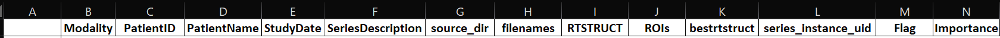
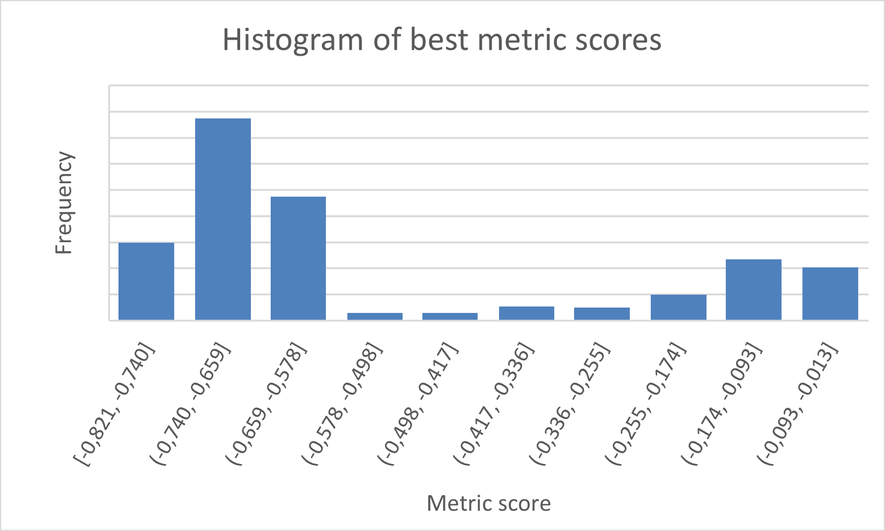
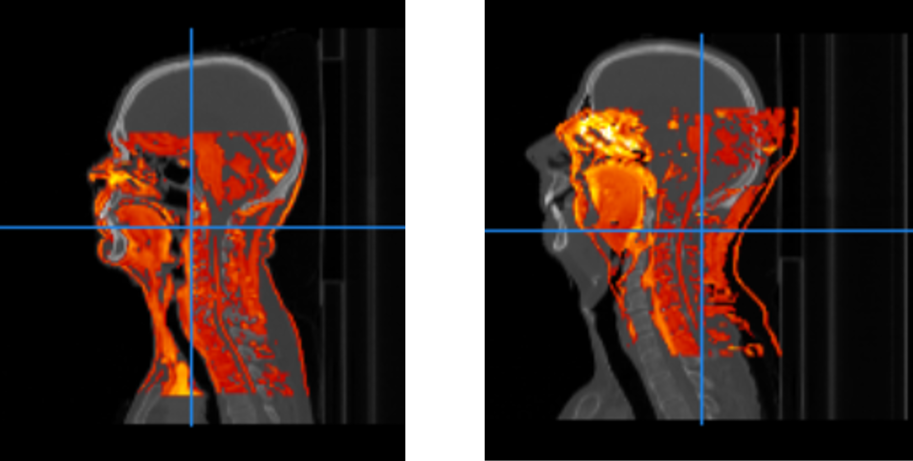

Implementation
***************

This section describes the various implementation choices that were made during
development of the pipeline. In the beginning, scans are stored as many different
files for many different scans performed at many different dates. The goal of the
pipeline is to produce a dataset comprising registered scans of all three modalities
(whenever available) along with doctor-made delineation information, all of which
need to be located in NIfTI-files and ready for deep learning development.

The pipeline is divided into three main parts: file format conversion from DICOM
to NIfTI; registration of images; evaluation of performed registrations.

DICOM-to-NIfTI conversion
=========================

..
    * Write a dictionary from dicom files 

The DICOM-files lie in several folders, each of which corresponds to a single patient.
The script runs through every DICOM-file and records which patient and which scan it
belongs to. It does this by producing a ``dictionary`` for each scan with all the necessary
information, such as Patient ID (anonymised), modality of the scan, date of the scan, which
files belong to this scan etc. An excerpt showing the different attributes saved to this 
dictionary can be seen below.

..
    Columns in Excel

    Excerpt showing the Excel-sheet header with names of the saved attributes.

The script saves the dictionary to an Excel-sheet named ``seriesdict_pre_selection.xlsx`` 
for convenient viewing. Then, it begins sorting through this complete list of scans to figure
out which ones to convert. A patient may have many different scans from many different 
dates, but it is desirable to only have scans from a limited span in time, e.g. if patient 
``qwertyuiop`` has one CT-scan, two MR-scans and a PT-scan from January 1st-5th 2020, but also has
one CT-scan and two MR-scans from August 10th 2020, the goal is to select a subset of 
those scans to progress with. This is to ensure that the ultimate deep learning model does not
get confounded by e.g. a change in tumour size between the two scan periods, which is likely 
to occur.

..
    * Perform selection of series

The decisions that the script makes are summarised by the flowcharts below. Briefly, it requires
each patient to have a *primary study* (a scan with delineations, typically a CT-scan) and optionally
one or more *secondary studies* (CT-, PT- and MR-scans without delineations) which must lie within'
7 days of the primary study. If there are several primary studies, it selects the one which has the 
most secondary studies within 7 days.

..
    * Flowchart - Jonathan

.. container:: img-magnifier-container

    .. figure:: images/convertor-dictwriter-flowchart-part-1.png
        :align: center
        :alt: alternate text
        :figclass: align-center
        :class: flowchart

        Part 1 of the ``dictwriter`` flowchart.

|
|
|

.. container:: img-magnifier-container

    .. figure:: images/convertor-dictwriter-flowchart-part-2.png
        :align: center
        :alt: alternate text
        :figclass: align-center
        :class: flowchart2

        Part 2 of the ``dictwriter`` flowchart.

The selected scans are saved to a new dictionary, which is likewise exported to an Excel-sheet named
``seriesdict_post_selection.xlsx``. Then, any issues that arose during selection of a patient's scans 
are flagged in the corresponding patient rows in both Excel-sheets. The flags are denoted with an '
importance indicator from 1-3, a flag description and by colouring the rows in a certain colour. 
Higher importance indicator means greater importance, and only the most important flag for a patient is
given. The types of flags currently used are:

..
    * Flagging issues for manual control

* *No series selected.* This occurs if the script cannot find any scans with delineations, i.e. no
  primary studies and thus no secondary studies either. No series will thus be converted for this patient,
  and in fact, this flag will never be shown in the post-selection Excel-sheet. Importance: 3. Colour: Red.
* *Missing secondary study. Check whether primary study is optimal.* This occurs when there are no
  secondary studies which lie within 7 days of any of the primary studies. Thus, the script cannot be sure
  that the selected primary study is indeed the best choice. Importance: 2. Colour: Orange.
* *Missing attribute.* This occurs when the DICOM-file has missing header information. Typically,
  it is a missing description of the scan. The description is not used by the script to make decisions,
  but it is nice to report it anyway. Importance: 1. Colour: Yellow.

..
    * Write nifti-files (optional including of different flags)

The above steps in conversion are all included in the ``dictwriter`` script. After running this script,
the developer should perform manual checking of the Excel-sheets, especially with respect to any flags
there may be. Following this, the ``filewriter`` script can be run. This script reads the post-selection
Excel-sheet and actually performs the DICOM-to-NIfTI conversion for the specified files. The ``filewriter``
script also takes arguments that give the option to include scans flagged in a certain colour as if they
were not flagged, e.g. yellow-flagged scans may be converted independently of orange- and red-flagged ones.

Registrations
=============
Registration is done via two methods: rigid and deformable. The rigid registration can only use translational
motion whereas the deformable registration can "shift" voxels if for example the jaw doesn't quite match.
The deformable registration is a bit more comprehensive since it first runs a rigid registration and then a 
deformable on the images. Also, the deformable registration uses a mask so as not to register on pixels that
represent air.

There are many different parameters to take into account when using rigid and deformable registration. We tried
several setups in order to find the one that performed best but in the end we ended up going with a setup
produced by our supervisor. Thus the registration part of the pipeline has not been produced by us. It is included
for the sake of completeness.

Evaluation of registrations
===========================
Evaluation of registrations can be done via several methods. We are using a cropbox in order to evaluate
the registration of our images. A cropbox is a cropped version of the image where the cropped part comprises 
more comparable parts of the image. The cropbox thus removes as many pixels as possible with a value of zero
but without removing pixels with values larger than zero. Thus it minimizes the amount of pixels that represent
air in the cropped image. The cropbox also contains a margin meaning after the image has been cropped an additional
amount of slices are removed in order to ensure that there are even less pixels representing air.

.. literalinclude:: ../../evaluation/evaluation.py
    :linenos:
    :lineno-start: 54
    :language: python
    :lines: 54-78
    :emphasize-lines: 13, 17-23

For evaluating the registration a metric is computed, in this case AdvancedMattesMutualInformation 
(a version of Mutual Information). One of 
the advantages of using this metric is that the modalities of the images don't have to be the same. So even
though the signal is of different intensity for the same tissue, Mutual Information can still give
us a decent measure of how well the registration went. Mutual Information is usually a positive number
which is desirable to maximise, however since the code framework only has minimisation implemented,
AdvancedMattesMutualInformation has a negative sign in front.

..
    Link about MutualInformation: https://matthew-brett.github.io/teaching/mutual_information.html 

During evaluation of the registration, images that get a low metric score is flagged. This allows the user
to do a manual evaluation of low performing registrations. Flagged registrations are coloured red in the output
file. A metric score of -0.5 has been chosen as the threshold for flagging registrations. The score is based
partly on manual evaluation of several registrations but also by plotting a histogram of the scores.

    Histogram of metric score

There is a clear drop around -0.5 meaning the frequency of registrations with a value of -0.5 or smaller is low.
It then makes sense to have -0.5 as a threshold since it doesn't remove too many of the registrations and we 
know from checking manually that registrations with a metric score of -0.5 or less are registered badly. When 
evalution of the registrations is done, an overview of the metric scores is produced as an excel sheet. The 
flagged values have been coloured red.

..
    * Figure exemplifying good vs. poor registrations

    A good (left) vs a poor (right) registration of T1-MR-scans to CT-scans
    (from different patients).
    The good registration had a metric value of -0.621, while the poor registration
    was evaluated to a value of -0.190.

..
    * Crop zero-columns
    * Crop threshold (manual)
    * Compute MutualInformation
    * Flag values below threshold
    * Logging

.. raw:: html

    

