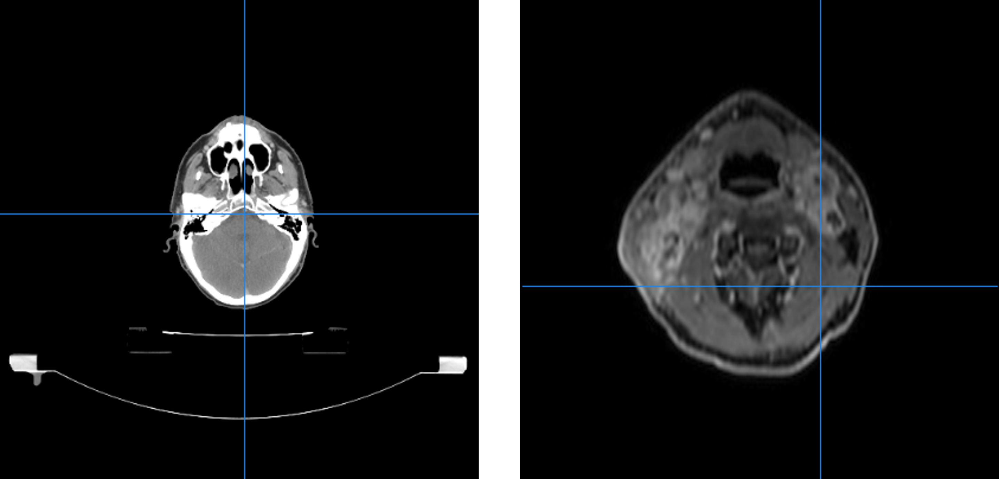
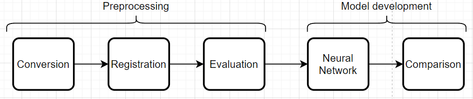

Original use case
******************

Our data 
========
..
    * Visual examples - different scans - Philip
    * Levels - color code - Philip
    * Noise e.g. table - Philip

The data consits of several different scans: CT, PET and MR. The scans have different color coding. For example
an MR scan will show bone as being dark whereas a CT scan will show bone as being bright which stems from
the way the different scans are produced. The scans also have different color codes for air and soft tissue.

    CT (left) and MR (right) scan of patient

Thus making it hard to threshold on color values. Especially on the CT-scans we noise arises in the form of the 
table the patient is lying on. This can also be seen in the above figure. A potential function would thus have a
hard time differentiating between bone and table. Dental fillings can also cause a problem both for CT and MR
scans. In CT scans they can cause a sort flaring whereas in MR they add to the variety of color codes.

..
    * Additional information - Jonathan
    * Delineation in RTSTRUCT - Jonathan

In addition to the images themselves, the data contains various header information, such as 
the *modality* of the image (i.e. whether it is a CT-, PET- or MR-scan), the date of the scan,
a medical description of the scan etc. This information is crucial in identifying the scans,
referring to them and making decisions about them.

For some of the scans (typically a CT-scan), a doctor has delineated various organs and/or tumors.
These delineations are saved as a set of lines in one or more so-called *RTSTRUCT*-file(s). The
RTSTRUCT-file also contains the name of each delineation, e.g. "brain" or "parotid_L" for the left
parotid gland. Occasionally, a single organ may have been delineated more than once, e.g. if a 
patient's tumor changed in shape or size due to treatment performed between two delineations. 
In this case, the two delineations will be saved in different RTSTRUCT-files from different dates.
The delineations must be kept track of alongside the rest of the data, as they are essentially what
an ultimate model must learn from. However, since not all scans have delineations, since not all
scans *with* delinations include the same organs and since not all scans with the same delineations
have identical naming schemes for those delineations, identifying the correct delineations is a
challenge that must be met.

..
    * Limitations - very heterogenous data - Busch
Our data is thus very heterogenous as seen with the varying color coding from scan to scan. Also the different
scans are not necessarily positioned equally in proportion to each other. One scan could be located in the top
right corner whereas another in the bottom left. The scans also have different dimensions which impacts cropping.
Sometimes a patient doesn't have both an MR and a CT scan which has to be taken into account when converting.
These are all limiting factors when wanting to do comparisons and evaluation.

Our pipeline and the big picture
================================
..
    * Preprocessing - conversion, registration, Evaluation - Philip
The module can be considered as a pipeline which consists of several steps: preprocessing, model development and
model usage.

    Flowchart of the pipeline

Preprocessing
-------------
The preprocessing part of the pipeline handles conversion, regristration and evaluation of the registrations.
This entails conversion of DICOM-files to the nifti format and afterwards regristration of the nifti files.
The evaluation is based on a metric score computed from the registrations. In our case the MutualInformation
metric makes sense and having an evaluation threshold at 0.5 is again case specific.

Model development
-----------------
..
    * Model development - neural network, comparison (CT vs CT+MR) - Busch 
Model development takes the registered images with an adequate metric score and runs them through a chosen 
neural network. In our case the neural network nnUNET is used. The idea is then to run the neural network first
with CT-scans only and then the registered images consisting of a CT and an MR and then compare. We are dealing
with supervised learning since we know what the delineations should look like. nnUNET is an attractive neural
network to use since it can figure out the hyperparameters (amount of layers, error function, number of neurons, 
etc.) given the images and labels.

..
    * Model usage - implementation, user acceptance - Busch

* Flowchart - Jonathan 

Challenges and solutions
========================

This sections describes a variety of challenges faced during the project along with
the solutions that were developed.

..
    * Missing header information in conversion - code example - Jonathan

One such challenge concerns the header information in the DICOM-files. When selecting
the scans for format conversion, it may at first glance be desirable to select based
on the medical description of the scans, e.g. to get an overview of what the scan
was used for. However, this is difficult due to the lack of standardisation of those
descriptions - in fact, there are occasionally scans which completely lack a description.
To overcome this challenge, we have avoided making decisions based on the description,
and wrapped the attribute reading in an exception catcher as follows.

.. literalinclude:: ../../dicom_conversion/convertorv3_functions.py
    :linenos:
    :lineno-start: 439
    :language: python
    :lines: 439-446
    :emphasize-lines: 441-446

..
    * Many edge cases e.g. missing secondary study - Jonathan

The general hetereogeneity of the data also poses a challenge, since there are so
many edge cases to consider. Some patients do not have a CT-scan with RTSTRUCT-files at
all, which consequently means none of the scans for that patient will be selected for 
conversion. This essentially causes any PET- and MR-scans to be dropped due to a lack of
CT-scans with delineations. The opposite is also an issue. If there are several CT-scans
with delineations, but no PET- or MR-scans, the selection program cannot be sure which
of the CT-scans to choose, since this is usually done by comparing how many PET- or MR-scans
relate to the individual CT-scans.

* A lot of data and therefore slow running - solved in conversion by splitting process. - Jonathan
..
    * Noise limiting use of thresholding - Philip
In proportion to evaluation of registered images thresholding on a color value was considered but noise in
the form of tables and dental fillings proved this procedure to be more complicated than first anticipated.
The solution was instead a mix of thresholding on color value and croppping the images using a cropbox. Thus
air was still efficiently removed via thresholding whereas noise as for example the table was removed by 
cropping the image via a margin.

* Thresholding based on change in pixel value turned out to be not possible - Philip
* Different MR's have different colors - Philip
* Field difficulty and lack of documentation - Busch
* Excel cell character limit - Jonathan
* 
 

